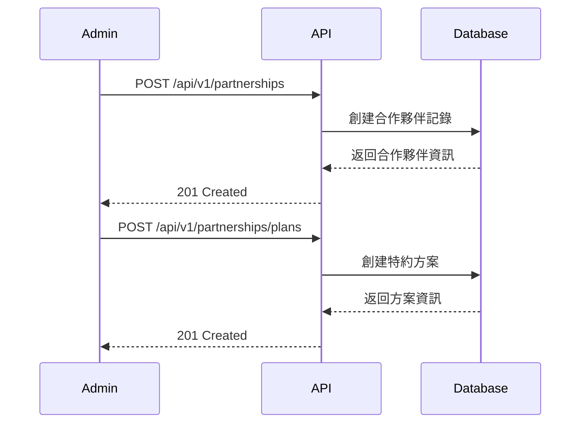
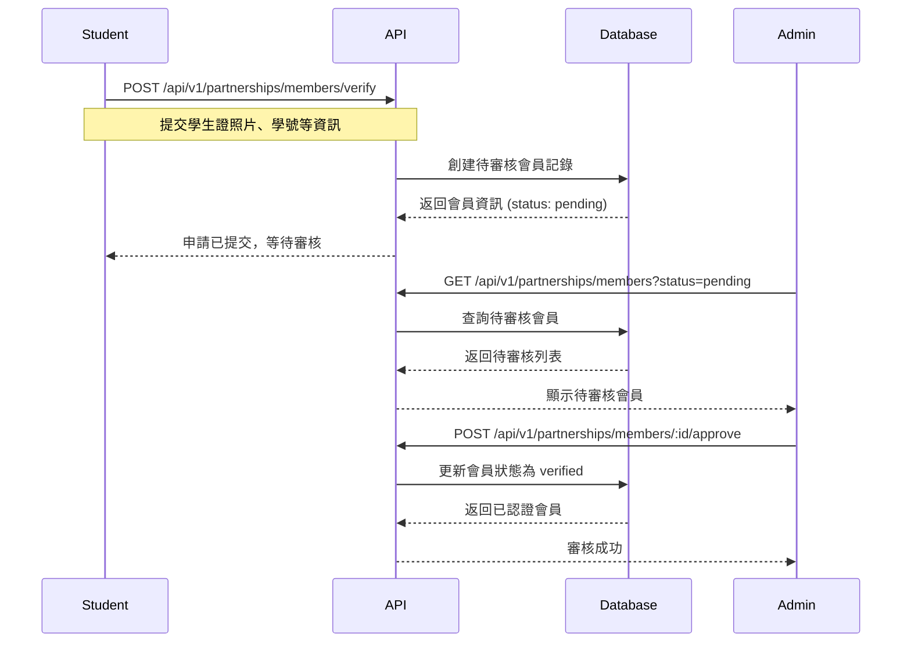
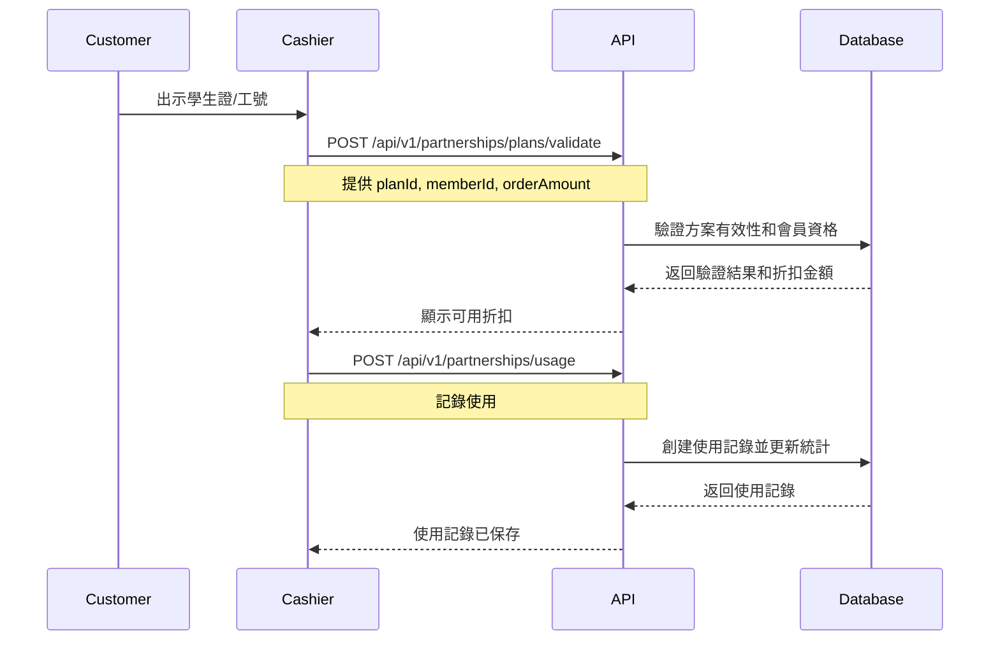

# 特約商店體系實現文檔

## 📋 目錄

1. [功能概述](#功能概述)
2. [系統架構](#系統架構)
3. [資料庫設計](#資料庫設計)
4. [API 端點](#api-端點)
5. [使用流程](#使用流程)
6. [範例程式碼](#範例程式碼)
7. [部署指南](#部署指南)

---

## 功能概述

特約商店體系允許餐廳與院校、企業、機構建立合作關係，為其成員（學生、員工）提供專屬優惠。

### 核心功能

✅ **合作夥伴管理**

- 創建和管理合作機構（大學、企業、政府機關等）
- 合約資訊追蹤（起迄日期、合約編號）
- 多種認證方式（Email 網域、學生證、QR Code、API）
- 完整的統計資料

✅ **特約方案管理**

- 為每個餐廳設定專屬優惠方案
- 彈性折扣設定（百分比、固定金額、特價）
- 精細化使用條件（最低消費、適用商品/分類、時段限制）
- 使用次數限制（每人、每日）
- 優惠疊加控制（可與優惠券/促銷組合）

✅ **會員認證管理**

- 學生/員工自助申請認證
- 管理員審核機制
- 認證有效期管理
- 會員使用統計

✅ **使用記錄追蹤**

- 完整的使用記錄（訂單、折扣金額、驗證方式）
- 支援取消和退款
- 多維度統計報表

---

## 系統架構

```
┌─────────────────────────────────────────────────────────┐
│                     前端層                              │
│  ┌────────────┐  ┌────────────┐  ┌────────────┐        │
│  │ Admin      │  │  Cashier   │  │  Public    │        │
│  │ Dashboard  │  │  POS       │  │  Portal    │        │
│  └────────────┘  └────────────┘  └────────────┘        │
└─────────────────────────────────────────────────────────┘
                           │
                           ↓
┌─────────────────────────────────────────────────────────┐
│                    API 層                               │
│  /api/v1/partnerships/*                                 │
│  - 合作夥伴管理 CRUD                                    │
│  - 方案管理 CRUD                                        │
│  - 會員認證審核                                         │
│  - 使用記錄和統計                                       │
└─────────────────────────────────────────────────────────┘
                           │
                           ↓
┌─────────────────────────────────────────────────────────┐
│                   服務層                                │
│  PartnershipService (packages/database/src/services)    │
│  - 業務邏輯處理                                         │
│  - 資料驗證                                             │
│  - 折扣計算                                             │
│  - 統計分析                                             │
└─────────────────────────────────────────────────────────┘
                           │
                           ↓
┌─────────────────────────────────────────────────────────┐
│                 資料庫層 (Cloudflare D1)                │
│  - partnerships (合作夥伴表)                            │
│  - partnership_plans (方案表)                           │
│  - verified_members (認證會員表)                        │
│  - partnership_usage_logs (使用記錄表)                  │
└─────────────────────────────────────────────────────────┘
```

---

## 資料庫設計

### 1. partnerships (合作夥伴表)

| 欄位                   | 類型    | 說明                                           |
| ---------------------- | ------- | ---------------------------------------------- |
| id                     | TEXT    | 主鍵 (UUID)                                    |
| partner_code           | TEXT    | 合作夥伴代碼（唯一）                           |
| partner_name           | TEXT    | 機構名稱                                       |
| partner_type           | TEXT    | 機構類型（university, school, corporation 等） |
| contact_person         | TEXT    | 聯絡人                                         |
| contract_start_date    | INTEGER | 合約起始日期 (Unix timestamp ms)               |
| contract_end_date      | INTEGER | 合約結束日期                                   |
| verification_method    | TEXT    | 認證方式                                       |
| allowed_email_domains  | TEXT    | 允許的 Email 網域 (JSON)                       |
| status                 | TEXT    | 狀態（draft, active, suspended 等）            |
| total_verified_members | INTEGER | 總認證會員數                                   |
| total_usage_count      | INTEGER | 總使用次數                                     |

### 2. partnership_plans (特約方案表)

| 欄位                   | 類型    | 說明                                         |
| ---------------------- | ------- | -------------------------------------------- |
| id                     | TEXT    | 主鍵 (UUID)                                  |
| partnership_id         | TEXT    | 合作夥伴 ID (外鍵)                           |
| restaurant_id          | TEXT    | 餐廳 ID (外鍵)                               |
| plan_code              | TEXT    | 方案代碼                                     |
| plan_name              | TEXT    | 方案名稱                                     |
| discount_type          | TEXT    | 折扣類型（percentage, fixed, special_price） |
| discount_value         | REAL    | 折扣值                                       |
| min_order_amount       | REAL    | 最低消費金額                                 |
| applicable_menu_items  | TEXT    | 適用商品 (JSON array)                        |
| applicable_days        | TEXT    | 適用星期 (JSON array)                        |
| usage_limit_per_member | INTEGER | 每會員使用限制                               |
| valid_from             | INTEGER | 有效期開始                                   |
| valid_to               | INTEGER | 有效期結束                                   |

### 3. verified_members (認證會員表)

| 欄位              | 類型    | 說明                                   |
| ----------------- | ------- | -------------------------------------- |
| id                | TEXT    | 主鍵 (UUID)                            |
| partnership_id    | TEXT    | 合作夥伴 ID (外鍵)                     |
| member_id         | TEXT    | 會員編號（學號/工號）                  |
| member_type       | TEXT    | 會員類型（student, employee 等）       |
| full_name         | TEXT    | 姓名                                   |
| status            | TEXT    | 狀態（pending, verified, rejected 等） |
| verified_at       | INTEGER | 認證通過時間                           |
| total_usage_count | INTEGER | 總使用次數                             |

### 4. partnership_usage_logs (使用記錄表)

| 欄位            | 類型    | 說明                                            |
| --------------- | ------- | ----------------------------------------------- |
| id              | TEXT    | 主鍵 (UUID)                                     |
| partnership_id  | TEXT    | 合作夥伴 ID (外鍵)                              |
| plan_id         | TEXT    | 方案 ID (外鍵)                                  |
| member_id       | TEXT    | 會員 ID (外鍵)                                  |
| order_id        | TEXT    | 訂單 ID (外鍵)                                  |
| discount_amount | REAL    | 實際折扣金額                                    |
| original_amount | REAL    | 原始金額                                        |
| final_amount    | REAL    | 最終金額                                        |
| used_at         | INTEGER | 使用時間                                        |
| status          | TEXT    | 狀態（pending, completed, cancelled, refunded） |

---

## API 端點

### 合作夥伴管理

```
POST   /api/v1/partnerships              創建合作夥伴
GET    /api/v1/partnerships              查詢合作夥伴列表
GET    /api/v1/partnerships/:id          獲取合作夥伴詳情
GET    /api/v1/partnerships/:id/statistics  獲取統計資料
PUT    /api/v1/partnerships/:id          更新合作夥伴
DELETE /api/v1/partnerships/:id          刪除合作夥伴
```

### 方案管理

```
POST   /api/v1/partnerships/plans        創建特約方案
GET    /api/v1/partnerships/plans        查詢方案列表
GET    /api/v1/partnerships/plans/:planId  獲取方案詳情
POST   /api/v1/partnerships/plans/validate  驗證方案並計算折扣
PUT    /api/v1/partnerships/plans/:planId  更新方案
DELETE /api/v1/partnerships/plans/:planId  刪除方案
```

### 會員管理

```
POST   /api/v1/partnerships/members/verify         提交會員認證申請（公開）
GET    /api/v1/partnerships/members                查詢會員列表
GET    /api/v1/partnerships/members/:memberId      獲取會員詳情
POST   /api/v1/partnerships/members/:memberId/approve  審核通過
POST   /api/v1/partnerships/members/:memberId/reject   審核拒絕
PUT    /api/v1/partnerships/members/:memberId      更新會員資訊
```

### 使用記錄

```
POST   /api/v1/partnerships/usage        記錄特約優惠使用
GET    /api/v1/partnerships/usage        查詢使用記錄列表
POST   /api/v1/partnerships/usage/:id/cancel  取消使用記錄
POST   /api/v1/partnerships/usage/:id/refund  退款使用記錄
```

---

## 使用流程

### 流程 1: 建立合作夥伴關係



### 流程 2: 會員認證流程



### 流程 3: 使用特約優惠



---

## 範例程式碼

### 創建合作夥伴

```typescript
const partnership = await fetch("/api/v1/partnerships", {
  method: "POST",
  headers: {
    "Content-Type": "application/json",
    Authorization: `Bearer ${token}`,
  },
  body: JSON.stringify({
    partnerCode: "NTUST-2025",
    partnerName: "國立台灣科技大學",
    partnerNameEn: "National Taiwan University of Science and Technology",
    partnerType: "university",
    contactPerson: "王小明",
    contactPhone: "02-2737-6000",
    contactEmail: "contact@mail.ntust.edu.tw",
    contractStartDate: Date.now(),
    contractEndDate: Date.now() + 365 * 24 * 60 * 60 * 1000, // 1 year
    verificationMethod: "email_domain",
    allowedEmailDomains: ["@mail.ntust.edu.tw", "@gapps.ntust.edu.tw"],
    defaultDiscountType: "percentage",
    defaultDiscountValue: 10,
    description: "提供台科大師生專屬優惠",
  }),
});

const result = await partnership.json();
console.log(result.data); // Partnership object
```

### 創建特約方案

```typescript
const plan = await fetch("/api/v1/partnerships/plans", {
  method: "POST",
  headers: {
    "Content-Type": "application/json",
    Authorization: `Bearer ${token}`,
  },
  body: JSON.stringify({
    partnershipId: "partnership-uuid",
    restaurantId: "restaurant-id",
    planCode: "STUDENT-LUNCH",
    planName: "學生午餐優惠",
    discountType: "percentage",
    discountValue: 15, // 85折
    maxDiscountAmount: 50, // 最多折50元
    minOrderAmount: 100, // 最低消費100元
    applicableDays: [1, 2, 3, 4, 5], // 週一到週五
    applicableTimeSlots: [
      { start: "11:00", end: "14:00" }, // 11:00-14:00
    ],
    usageLimitPerMember: 5, // 每人限用5次
    validFrom: Date.now(),
    validTo: Date.now() + 180 * 24 * 60 * 60 * 1000, // 半年
    showOnMenu: true,
    badgeText: "學生優惠",
    badgeColor: "#4CAF50",
  }),
});

const result = await plan.json();
console.log(result.data); // Plan object
```

### 會員認證申請

```typescript
const verification = await fetch("/api/v1/partnerships/members/verify", {
  method: "POST",
  headers: {
    "Content-Type": "application/json",
  },
  body: JSON.stringify({
    partnershipId: "partnership-uuid",
    memberId: "B10812345", // 學號
    memberType: "student",
    fullName: "張三",
    email: "b10812345@mail.ntust.edu.tw",
    phone: "0912345678",
    verificationMethod: "email_domain",
    department: "資訊工程系",
    gradeOrPosition: "大三",
    studentIdPhotoUrl: "https://example.com/student-id.jpg",
  }),
});

const result = await verification.json();
console.log(result.message); // "Verification request submitted successfully"
```

### 驗證方案並計算折扣

```typescript
const validation = await fetch("/api/v1/partnerships/plans/validate", {
  method: "POST",
  headers: {
    "Content-Type": "application/json",
    Authorization: `Bearer ${token}`,
  },
  body: JSON.stringify({
    planId: "plan-uuid",
    memberId: "member-uuid",
    orderAmount: 200,
    menuItems: ["menu-item-1", "menu-item-2"],
    categories: ["category-1"],
  }),
});

const result = await validation.json();
if (result.data.valid) {
  console.log("Discount:", result.data.discountAmount);
  console.log("Final Amount:", result.data.finalAmount);
  console.log(
    "Can combine with coupons:",
    result.data.canCombineWithOthers.coupons,
  );
} else {
  console.log("Error:", result.data.error);
}
```

### 記錄使用

```typescript
const usage = await fetch("/api/v1/partnerships/usage", {
  method: "POST",
  headers: {
    "Content-Type": "application/json",
    Authorization: `Bearer ${token}`,
  },
  body: JSON.stringify({
    partnershipId: "partnership-uuid",
    planId: "plan-uuid",
    memberId: "member-uuid",
    orderId: "order-uuid",
    restaurantId: "restaurant-id",
    discountType: "percentage",
    discountValue: 15,
    discountAmount: 30,
    originalAmount: 200,
    finalAmount: 170,
    channel: "dine_in",
  }),
});

const result = await usage.json();
console.log(result.message); // "Usage logged successfully"
```

---

## 部署指南

### 1. 資料庫遷移

```bash
# 本地環境
npx wrangler d1 migrations apply makanmasak-staging --local

# Staging 環境
npx wrangler d1 migrations apply makanmasak-staging --env staging

# Production 環境
npx wrangler d1 migrations apply makanmasak-prod --env production
```

### 2. 驗證遷移

```bash
# 檢查資料表是否正確創建
npx wrangler d1 execute makanmasak-staging --local \
  --command "SELECT name FROM sqlite_master WHERE type='table' AND name LIKE 'partnership%'"
```

預期輸出：

```
partnerships
partnership_plans
verified_members
partnership_usage_logs
```

### 3. 測試範例資料

資料庫遷移會自動插入一筆範例合作夥伴（台灣科技大學）：

```sql
SELECT * FROM partnerships WHERE partner_code = 'NTUST-2025';
```

### 4. 部署 API

```bash
# 部署到 Staging
npm run deploy:staging

# 部署到 Production
npm run deploy:prod
```

### 5. 環境變數

無需額外環境變數，系統使用現有的 Cloudflare D1 綁定。

---

## 安全性考量

### 認證和授權

- ✅ 所有管理端點需要 JWT 認證
- ✅ 角色權限控制（Admin, Shop Owner, Cashier）
- ✅ CSRF 保護（除公開端點外）
- ✅ 會員申請端點公開但有 Rate Limiting

### 資料保護

- ✅ 敏感資料（學生證照片）儲存在 Cloudflare R2
- ✅ 所有時間戳使用 Unix timestamp（毫秒）
- ✅ 外鍵約束確保資料完整性
- ✅ 觸發器自動更新統計數據

### 效能優化

- ✅ 24 個索引優化查詢效能
- ✅ 3 個視圖簡化複雜查詢
- ✅ 9 個觸發器自動維護統計
- ✅ 分頁查詢支援大量資料

---

## 未來擴展

### 階段 2 功能

- 📱 會員自助管理 Portal
- 📊 進階分析報表（使用趨勢、熱門時段）
- 🔔 自動通知系統（認證結果、優惠到期提醒）
- 🎫 QR Code 會員證生成

### 階段 3 功能

- 🤝 多餐廳聯合優惠
- 💳 會員儲值系統整合
- 📈 AI 推薦優惠方案
- 🌐 多語言支援擴展

---

## 技術支援

- **文檔**: `/docs/PARTNERSHIP_SYSTEM_IMPLEMENTATION.md`
- **API 端點**: `https://api.makanmasak.com/api/v1/partnerships`
- **範例程式碼**: `/apps/api/src/features/partnerships`
- **資料庫 Schema**: `/packages/database/migrations/0047_merchant_partnership_system.sql`

---

**版本**: 1.0.0
**最後更新**: 2025-11-23
**狀態**: ✅ Production Ready
